# COMP1100 Assignment 2

In this assignment, you will explore another way of thinking about
graphics, inspired by the [robotic
"turtles"](https://en.wikipedia.org/wiki/Turtle_graphics) that some of
you might associate with the [LOGO programming
language](https://en.wikipedia.org/wiki/Logo_%28programming_language%29). You
can think of the turtle as a machine with a pen, that sits on a sheet
of paper. As it moves around the page, it drags the pen along the
paper to draw pictures. You will be writing Haskell to generate
instructions for a virtual turtle, and writing more Haskell to
interpret these instructions into a CodeWorld `Picture`.

{:.msg-info}
This assignment is worth 12% of your final grade.

{:.msg-warn}
**Deadline**: Friday  May 7, 2021, at 11:00pm Canberra time *sharp*


## Overview of Tasks

This assignment is marked out of 100 for COMP1100, or 120 for COMP1130:

| **Task**                             | **COMP1100** | **COMP1130** |
|--------------------------------------|--------------|--------------|
| Task 1: Drawing Shapes               | 10 Marks     | 5 Marks      |
| Task 2: Interpreting Turtle Commands | 30 Marks     | 30 Marks     |
| Task 3A: Cantor Set and Hilbert Curve| 25 Marks     | N/A          |
| Task 3B: L-Systems                   | N/A          | 40 Marks     |
| Unit Tests                           | 10 Marks     | 10 Marks     |
| Style                                | 10 Marks     | 10 Marks     |
| Technical Report                     | 15 Marks     | 25 Marks     |

{:.msg-warn}
From this assignment onward, code that does not compile will be penalised
heavily. This means that **both** the commands `cabal v2-run turtle` and 
`cabal v2-test` must run without errors. If **either** of those commands
fail with an error, a very heavy mark deduction will be applied. 
If you have a partial solution that you cannot get working, you
should comment it out and write an additional comment directing your
tutor's attention to it.

## Getting Started

Fork the assignment repository and create a project for it in VS Code/Codium,
following the same steps as in [Lab
2](https://cs.anu.edu.au/courses/comp1100/labs/02/#forking-a-project). The
assignment repository is at
<https://gitlab.cecs.anu.edu.au/comp1100/comp1100-assignment2>.

## Overview of the Repository

Most of your code will be written in `src/Turtle.hs`. You will also
need to write tests in `test/TurtleTest.hs`, which contains some
example tests for you to study.

### Other Files

* `test/Testing.hs` is the testing library we used in Assignment 1,
  extended with some useful functions for this assignment. You should
  read this file as well as `test/TurtleTest.hs`, and make sure you
  understand how to write tests.

* `app/Main.hs` is a small test program that uses your turtle code. We
  discuss its features in "Overview of the Test Program".

* `comp1100-assignment2.cabal` tells the cabal build tool how to build
  your assignment. You are not required to understand this file, and
  we will discuss how to use cabal below.

* `Setup.hs` tells cabal that this is a normal package with no unusual
  build steps. Some complex packages (that we won't see in this
  course) need to put more complex code here. You are not required to
  understand it.

## Overview of Cabal

As before, we are using the `cabal` tool to build the assignment
code. The commands provided are very similar to last time:

* `cabal v2-build`: Compile your assignment.

* `cabal v2-run turtle`: Build your assignment (if necessary), and run
  the test program.

* `cabal v2-repl comp1100-assignment2`: Run the GHCi interpreter over
  your project.

* `cabal v2-test`: Build and run the tests. This assignment is set up to
   run a unit test suite like in Assignment 1, but this time you will
   be writing the tests. The unit tests will abort on the first
   failure, or the first call to a function that is `undefined`.

{:.msg-info}
You should execute these cabal commands in the **top-level directory** of your
project: `~/comp1100/assignments/assignment2` (i.e., the directory you are in when you
launch the VSCodium Terminal tool for your project).


## Overview of the Test Program

The test program in `app/Main.hs` uses CodeWorld, just like Assignment
1, and responds to the following keys:

| Key     | Effect                                                                 |
|---------|------------------------------------------------------------------------|
| `M`     | Display the test image                                                 |
| `T`     | Display a triangle (from Task 1)                                       |
| `P`     | Display a polygon (from Task 1)                                        |
| `=`/`-` | Increase/decrease the number of sides (polygon mode only, from Task 1) |
| `C`     | Display the Cantor set                                                 |
| `H`     | Display the Hilbert Curve                                              |
| `Z`     | Toggle between zoomed and actual size of Cantor set and Hilbert Curve  |
| `=`/`-` | Increase/decrease the depth of Cantor and Hilbert approximations.      |

{:.msg-warn}
If you try to use the test program without completing Task 2, or you
try to draw something you haven't implemented yet, the test program
will call a function that is set to equal `undefined` 
and so it will crash with the following error:
```
"Exception in blank-canvas application:"
Prelude.undefined
```
In the latter case, if this happens, 
refresh the browser to continue using the test program.


## Turtles and the `TurtleCommand` Type

We are going to imagine a _turtle_ as a point-sized robot that sits on
a canvas. This robot has:

* a pen;
* a _position_ on the canvas; and
* a direction (_facing_), and magnitude (_speed_) of its movement.


There are five classes of commands that we can send to the turtle, and
we represent those commands with the constructors of the
`TurtleCommand` type:

    type Radians = Double

    data TurtleCommand
      = Forward
      | PenUp
      | PenDown
      | Turn Radians
      | Accelerate Double
      deriving Show

The commands have the following meaning:

| Command        | Meaning                                                                                                                                                                                                                                                                                                  |
|----------------|----------------------------------------------------------------------------------------------------------------------------------------------------------------------------------------------------------------------------------------------------------------------------------------------------------|
| `Forward`      | Drive forward `v` units from the current _position_, along the current _facing_, where `v` is the current _speed_. Draw a line between the old and new _positions_.                                                                                                                                      |
| `PenUp`        | Lift the _pen_. The turtle will not draw on `Forward` commands until a it reaches a `PenDown` command.                                                                                                                                                                                                   |
| `PenDown`      | Lowers the _pen_. The turtle will draw on `Forward` commands until a it reaches a `PenUp` command.                                                                                                                                                                                                       |
| `Turn t`       | Turn `t` _radians_ (360 degrees = `2 * pi` radians) from the current _facing_. This changes the direction that the turtle will drive in response to future `Forward` commands. Anticlockwise turns are represented by positive values of `t`; clockwise turns are represented by negative values of `t`. |
| `Accelerate a` | Change speed by a *factor of* $`a`$. This changes the current speed so that if the turtle was traveling at speed $`v`$, it will now travel at speed $`av`$.                                                                                                                                                    |

Where we measure _speed_ as units traveled per `Forward` command. 

## Task 1: Drawing Shapes (10 marks)

To draw a (CodeWorld) `Picture` with turtle graphics, we need two
things: the commands to draw, and a way of interpreting those
commands. In this task, you will define some functions that generate
lists of turtle commands. When you have built the interpreter in Task
2, these functions will be a source of test data that you can use to
check your interpreter.

### Your Task

Define the following two functions in `src/Turtle.hs`:

* `triangle :: Double -> [TurtleCommand]`

  - Return a list of commands that will draw an equilateral triangle
    with side length equal to the argument. You should put the pen
    down before you do anything else. The turtle should finish with
    the same _position_ and _facing_ as when it started.

  - If the argument is negative, raise an error. (If `triangle` is ever given
    a negative argument, we know there is something wrong with the test program. 
    So, we want to raise an error to stop the test program so we know to fix it.)

* `polygon :: Int -> Double -> [TurtleCommand]`

  - `polygon n s` should return a list of commands that will draw a
    regular `n`-sided polygon, with perimeter equal to `s`. You
    should put the pen down before you do anything else. The turtle
    should finish with the same _position_ and _facing_ as when it
    started. If `n < 3`, raise an error.

  - If `s` is negative, raise an error.


  - In the test program, `s` is set to 12 by default (why is this convenient?)

### Hints

* The function `fromIntegral` can convert an `Int` into a `Double`.

* You won't yet have an interpreter to test your generated
  `[TurtleCommand]` results. You can read ahead to the section on Unit
  Tests and write tests for these functions, or try working through a
  list of commands with a ruler and graph paper.

* Try drawing a regular triangle, square or regular hexagon on a sheet
  of graph paper. Then place your pen on one corner and pretend that
  it is the turtle. What commands do you have to tell your turtle to
  make it trace the figure you drew on the graph paper?

* The two points above are very similar, but work in opposite
  directions: the first one is asking you to check the result of your
  code by interpreting the results literally. The second point is
  looking at a correct result and asking yourself "what needed to
  happen to produce this?". Being able to think in both directions is
  very useful.

* The identity that the angles of a triangle (in radians) 
  add up to $`\pi`$ may come in handy.


## Task 2: Interpreting Turtle Commands (30 marks)

Lists of `TurtleCommand` values are just data, but are useful because
we can _interpret_ them into a (CodeWorld) `Picture`. This is morally
the same as the programming you are doing right now - a `.hs` file is
just textual data, but becomes more useful because we can interpret it
as a Haskell program. The difference is only in degree, not kind.

### Your Task

Define a function `runTurtle :: [TurtleCommand] -> Picture` in
`src/Turtle.hs`, which interprets the `[TurtleCommand]` according to
the rules laid out in the "Turtles and the `TurtleCommand`" section
above. Assume that the turtle starts with its _pen_ up, at `(0,0)`, facing north
(straight up), at a speed of 1 unit per `Forward` command. 
So a `Forward` command would take the initial turtle from `(0,0)`
to `(0,1)` without drawing.

If you have completed this task correctly, the test pattern you get by
pressing `M` in the test program will look like this (click for larger
version):

<a href="pictures/TestPattern.png">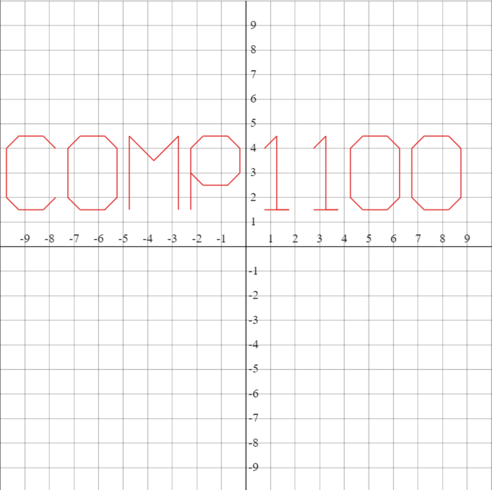</a>

### Hints

* You cannot consider a turtle command on its own; you need to know
  what the turtle has already done. For example, you need to know the
  _facing_ to determine the new position after evaluating
  `Forward`. We recommend defining:

  - a data type `TurtleState`, which tracks the turtle's _pen_, _position_,
    _facing_ and _speed_. The latter two may be taken together if you wish.
  - a value `initialState :: TurtleState`, for the turtle's initial
    position, facing, etc.

* Work through a simple `[TurtleCommand]` on paper, to see what your
  program needs to do.

* Break your solution apart into several functions, and test each in
  isolation. If you find that function is not behaving like you
  expect, you will have smaller units of code to debug, which is
  easier to get your head around.

* You may want to create *type alias*es for some of the fields in 
  your new data type for clarity.  

## Task 3A: Cantor set and Hilbert Curve (COMP1100 Only: 25 Marks)

### Cantor Set

The [Cantor set](https://en.wikipedia.org/wiki/Cantor_set)
is a subset of the interval $`[0,1]`$ which has a *fractal* 
(self-similar) structure. The set itself has zero length, which makes it 
somewhat uninteresting to draw (Although interestingly, despite this,
it has the same cardinality - or number of points - as the whole real line!)
However, we can draw approximations to the Cantor set using the following rules:

* The approximation at depth zero is the whole interval $`\mathcal{C}_0 = [0,1]`$,
 so the line drawn from $`(0,0)`$ to $`(1,0)`$.

* The approximation at depth $`n`$ is the approximation at depth $`n-1`$ with the 
  middle third of each line segment excluded. 
  e.g. $`C_1 = [0,\frac{1}{3}]\cup [\frac{2}{3},1]`$ or the line drawn from 
  $`(0,0)`$ to $`(\frac{1}{3},0)`$ and the line drawn from $`(\frac{2}{3},0)`$ to $`(1,0)`$. 

In the test program, approximations to the cantor set are highlighted in white over the 
black $`x`$ axis of the coordinate plane. They have also been rescaled over the interval 
$`[0,9]`$ to make them easier to see. You can switch to the actual size by pressing `Z`.

The first five approximations are seen below: 


<a href="pictures/c0.png">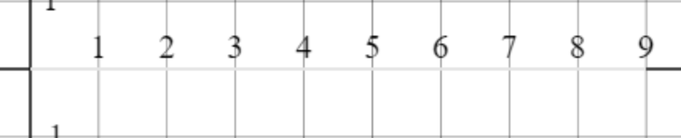</a>


<a href="pictures/c1.png">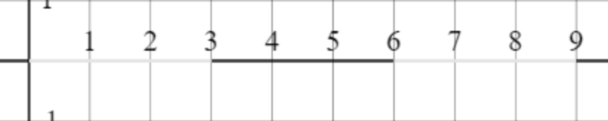</a>


<a href="pictures/c2.png">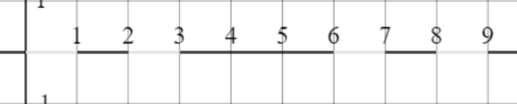</a>


<a href="pictures/c3.png">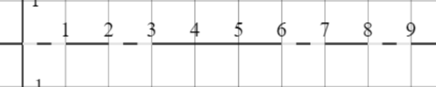</a>


<a href="pictures/c4.png">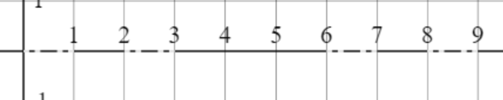</a>


### Hilbert Curve

While the Cantor set dissapears to zero length while maintaining uncountably many points,
the [Hilbert curve](https://en.wikipedia.org/wiki/Hilbert_curve) - a one-dimensional
line on the two-dimensional plane - fills the plane and (in its limit)
has positive area, despite each approximation having zero area. 
The Hilbert curve and other Peano (space filling) curves
can be used to map one-dimensional data to a two-dimensional 
space with some preservation of distance. 

In our definition of the Hilbert curve, the first iteration, 
$`\mathcal{H}_0`$ looks like a $`\sqcap`$.
With a line drawn from $`(\frac{1}{4},\frac{1}{4})`$ to
$`(\frac{1}{4}, \frac{3}{4})`$, followed by a line from there to 
$`(\frac{3}{4},\frac{3}{4})`$ and then finally a line to 
$`(\frac{3}{4},\frac{1}{4})`$.  

$`\mathcal{H}_n`$ is then defined by splitting each $`\mathcal{H}_{n-1}`$ (i.e., each $`\sqcap`$)
 according to the rules 
in the following: 

<a href="pictures/production_rules.svg"></a>

As with the Cantor set, we have rescaled your drawing so that it is easier to see. Pressing `Z` 
will revert the drawing to its actual position.
The first 8 approximations can be seen below. 


<a href="pictures/1.png">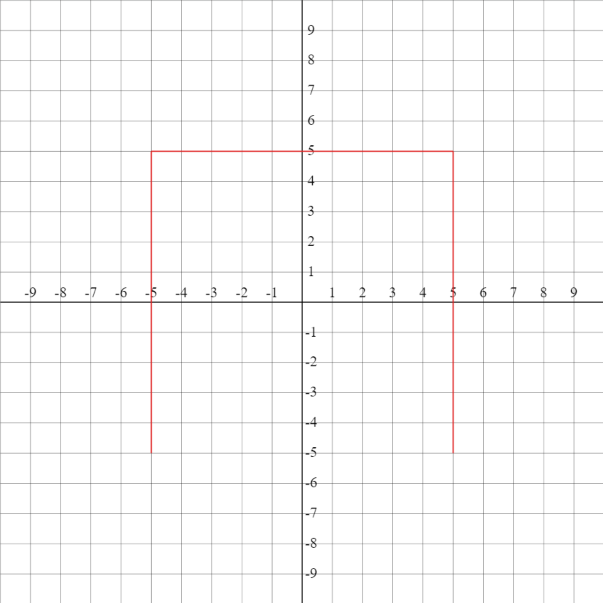</a>
<a href="pictures/2.png">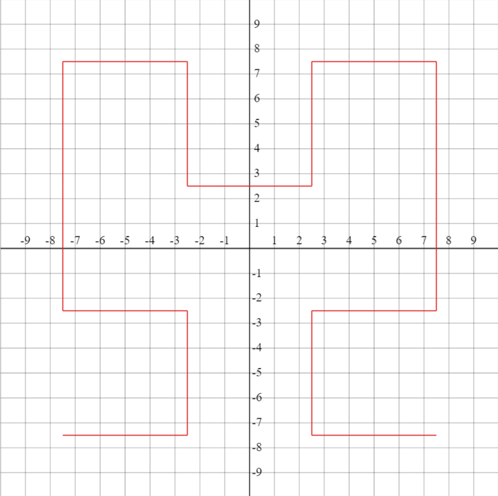</a>
<a href="pictures/3.png">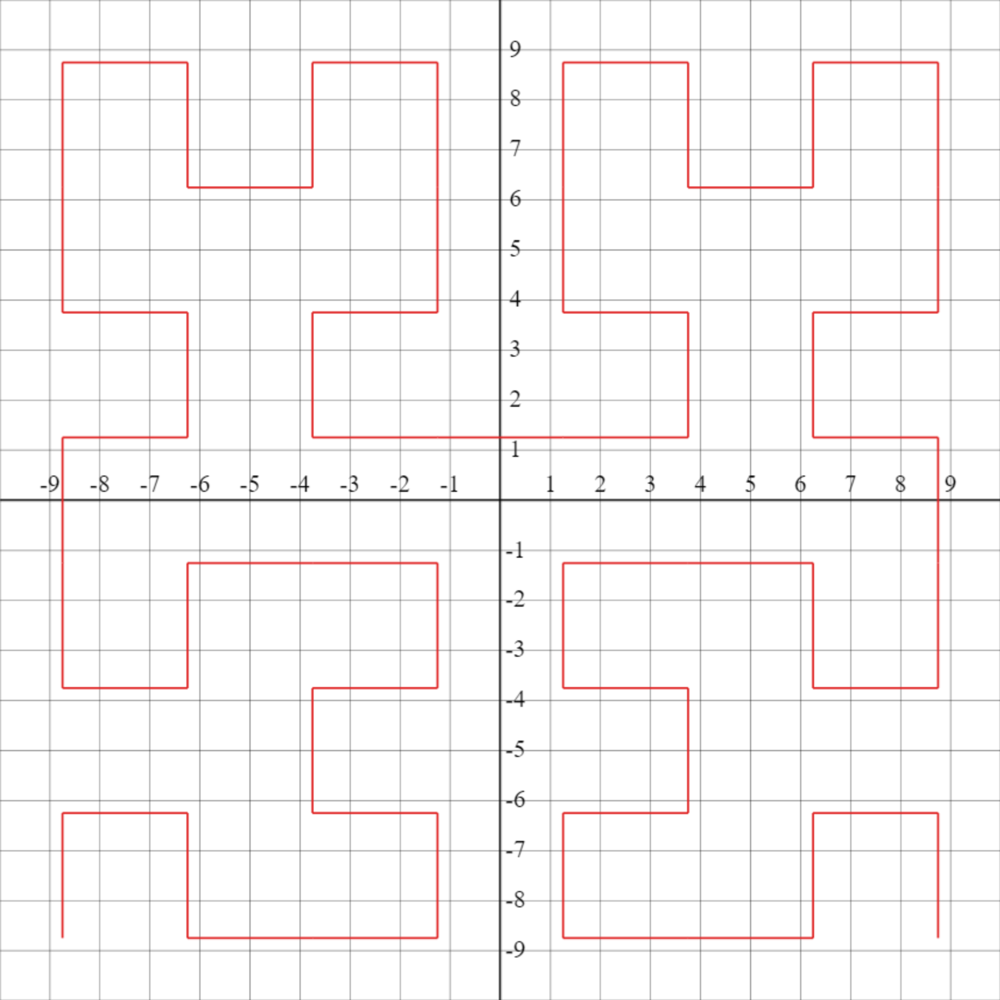</a>
<a href="pictures/4.png">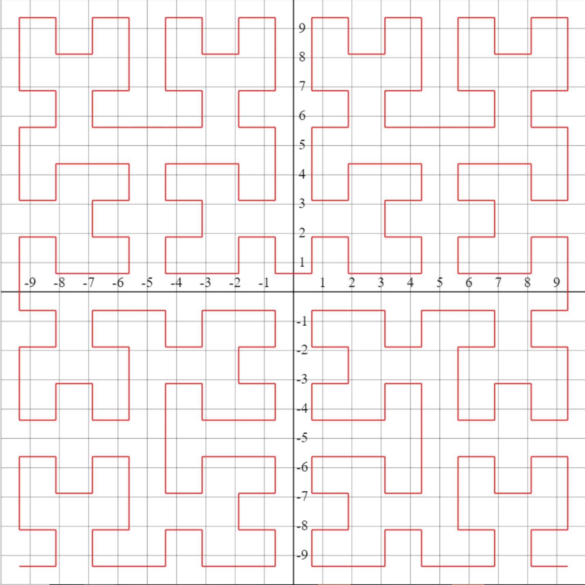</a>
<a href="pictures/5.png">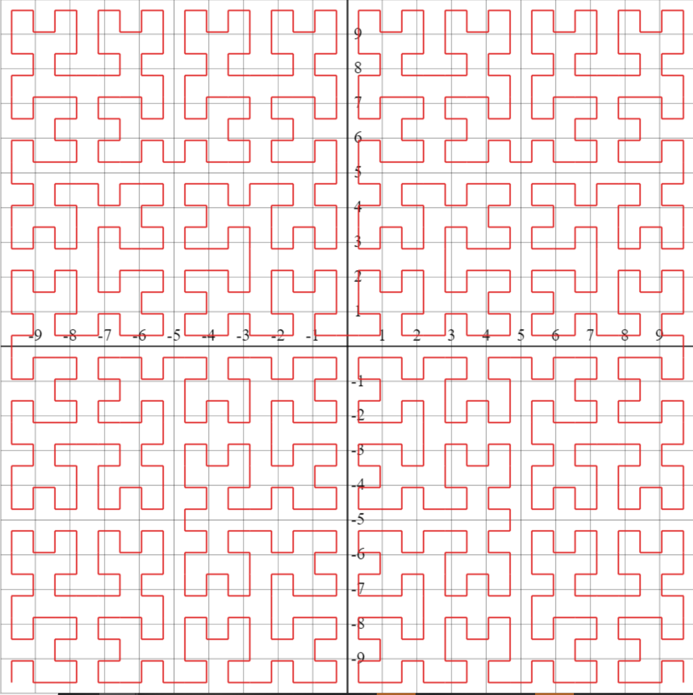</a>
<a href="pictures/6.png">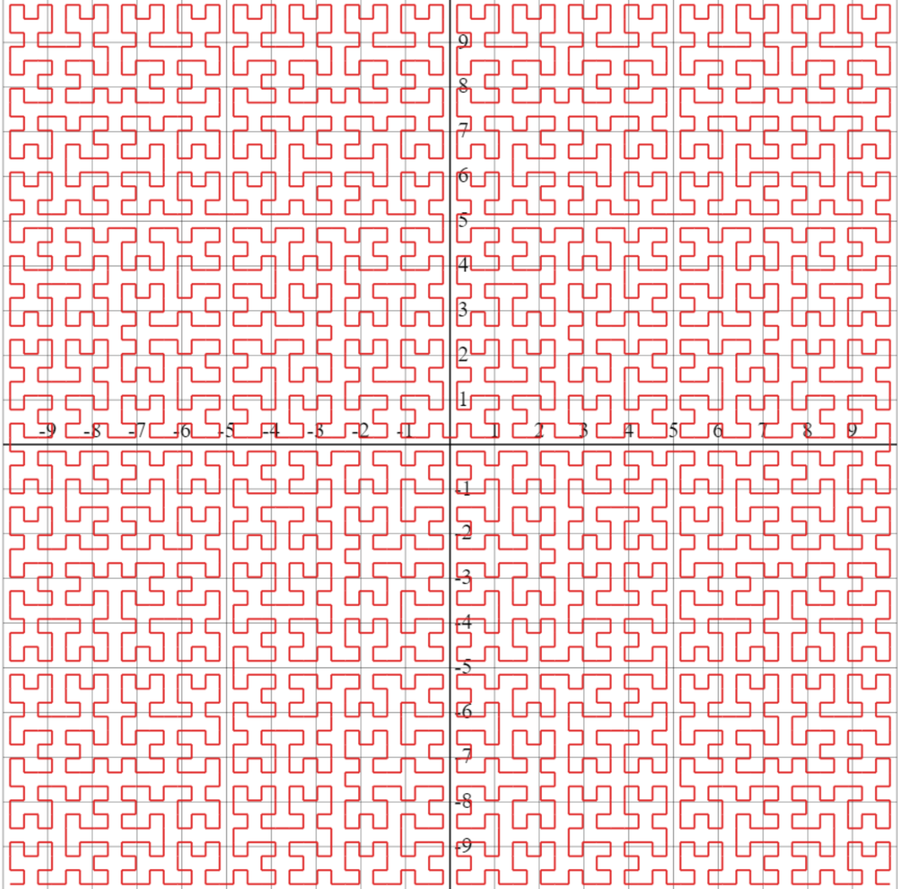</a>
<a href="pictures/7.png">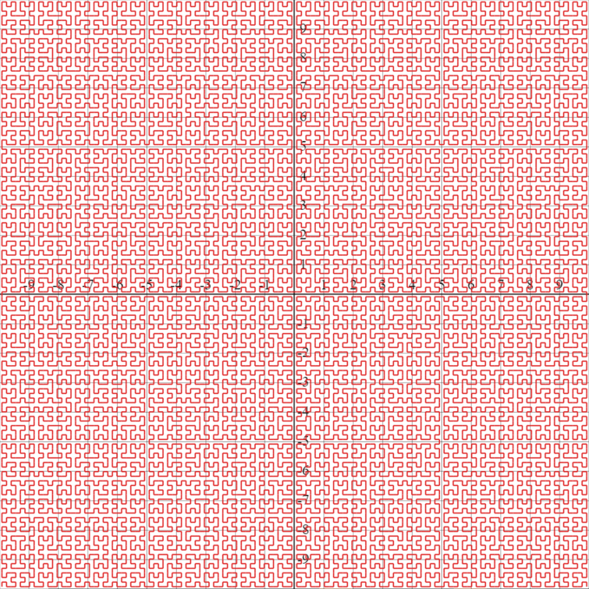</a>
<a href="pictures/8.png">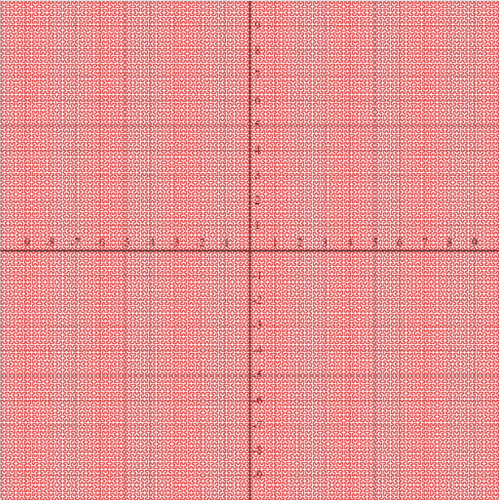</a>

{:.msg-info}
The last couple of images illustrate how the curve fills the plane quite quickly. 
Don't worry if your code takes a little while to generate this - or doesn't at all  
(e.g., the last one took around a minute when tested). 

### Your Tasks

Define functions `cantor :: Int -> [TurtleCommand]` and 
`hilbert :: Int -> [TurtleCommand]` in
`src/Turtle.hs`, which generate the necessary commands to draw.
approximations to the Cantor set and Hilbert curve respectivley. 
The argument specifies the *depth* of the approximation.
The turtle should finish with the same *position*, *speed*
and *facing* as when it started.

If *depth* is negative, raise an error.

#### Hints

* Be very clear in your mind about what happens at each level. Trace
  out a path for the turtle on graph paper, using the diagrammed
  behaviour as a guide. Most drawing only happens at depth 0, and
  the other levels of the recursion position the turtle without
  drawing.

* If you get stuck, try writing out commands for at
  *depth* 1, without recursion (but following the diagrams closely),
  then look for subsequences that look like the instructions to draw a
  *depth* 1 approximation.

* You will likely need to have a helper function that does all the required
  movements, called by a function that does the setup (moves into an appropriate turtle state
  to start the commands) and then after the correct movements, returns the turtle to 
  its initial state.  

* The drawing of $`\mathcal{H}_{n+1}`$ begins half way in between where the 
  drawing of  $`\mathcal{H}_{n}`$ begins, and the origin. 

* Make sure that as the turtle leaves each section
  it has the correct _facing_ and _acceleration_. 

* If you are stuck on `hilbert` close to the deadline, you may want to focus on
  your report. There should be plenty to talk about from your attempt at `cantor`. 
  (And, if applicable, your attempt at `hilbert`). 


## Task 3B: L-Systems (COMP1130 only: 40 marks)

During his study of filamentous fungi and other simple biological
structures, Hungarian biologist Astrid Lindenmayer invented a type of
formal language that can model their development. These languages have
come to be called [L-Systems](https://en.wikipedia.org/wiki/L-system),
and are comprised of three parts:

1. An _alphabet_ of symbols.
2. An _initial string_, consisting of symbols from that alphabet.
3. A _production rule_ which we apply to every symbol, to derive the
   next generation. If our rule does not mention a symbol, we send
   that symbol to itself.

### Example

From the [Hilbert curve wikipedia page](https://en.wikipedia.org/wiki/Hilbert_curve#Representation_as_Lindenmayer_system).

We choose the set _{A, B, F, +, -}_ for our set of symbols, and _A_
as our initial string. Our rule for computing the next generation is:

| Symbol | Expansion     |
|--------|---------------|
| _A_    | _+BF-AFA-FB+_ |
| _B_    | _-AF+BFB+FA-_ |

(_+_, _-_ and _F_ are unspecified, so they expand to themselves)

The first three levels of this system expand as follows:

* _A_ (level 0)
* _+BF-AFA-FB+_ (level 1)
* _+(-AF+BFB+FA-)F-(+BF-AFA-FB+)F(+BF-AFA-FB+)-F(-AF+BFB+FA-)+_ (level 2)

Where I have used parethesis for clarity, but note they are not part of the alphabet. 

### Connection to Turtle Graphics

By interpreting each symbol from an L-System's alphabet as zero or
more `TurtleCommand`s, we can interpret the strings generated by an
L-System as programs to draw pictures. We can draw a Hilbert curve by moving our turtle to an appropriate starting state (which can be done either through direct turtle commands, or adding appropriate additional terms to our alphabet), and then interpreting the above alphabet as follows:
 
| Symbol | Meaning              |
|--------|----------------------|
| _F_    | `Forward`            |
| _A_    | None                 |
| _B_    | None                 |
| _+_    | `Turn (pi / 2)`      |
| _-_    | `Turn (-pi / 2)`     |

### Your Tasks

1. Define machinery for describing and interpreting L-Systems in
   `src/Turtle.hs`:

   * A *data* type `LSystem a` that represents L-Systems over some alphabet
     type. A value of this type should hold a system's _initial
     string_ and _production rule_.

     - Hint: `(->)` is a type constructor like `Maybe` or `[]`, so
       functions can appear inside a `data` declaration.

   * A function `interpretLSystem :: LSystem a -> Int ->
     [a]`.  `interpretLSystem sys n` should expand the L-System `sys` to
     depth `n`. If `n < 0`, raise an error.


2. Use your L-System machinery to generate an approximation to
   the hilbert curve according to the rules given in the example
   above. In `src/Turtle.hs`, define:

   * A *data* type `HilbertAlphabet` representing the *alphabet* for the
     example L-System;

   * A value `hilbertSystem :: LSystem HilbertAlphabet` that
     implements the Hilbert L-System described above; and

   * A function `hilbert :: Int -> [TurtleCommand]` which
     generates the commands to draw an approximation to the Hilbert
     Curve. `hilbert n` should expand `hilbertSystem` to depth
     `n`, and convert the resulting string into turtle commands. When
     interpreting `F` and `G` from the L-System, drive the turtle forward
     `d` units. This function may also bring the turtle to its correct
     starting state, and return it to the correct finish state, though 
     you may also include these instructions in the `L` system. 


3. Use your L-System machinery to produce your own picture. Find (or
   invent) an L-System which can be interpreted to produce a picture
   that pleases you. Define:

   * A type representing the symbols in its _alphabet_;

   * A value representing the L-System's _initial string_ and _production
     rule_; and

   * A value `lSystemCommands :: [TurtleCommand]`. These commands,
     when interpreted to a `Picture`, should draw your L-System on the
     canvas, expanded to a depth that looks good when viewed in the
     test program. You may need to set the turtle's initial *position*
     and *facing* by prepending extra turtle commands before you run
     the L-System; feel free to do so.
  
   * This should be **your own** L-system. Don't just find rules for one online. 
     (Though you may want to look at the literature for inspiration, if you wish).
     In particular, it is not sufficient to implement the Cantor set for this 
     part. You of course may implement it for testing's sake, but there will
     be no marks specifically for implementing the Cantor set using L-systems. 

#### Note

Some L-Systems (particularly ones that generate branching structures
like trees) require an interpretation that saves and loads the
turtle's *position* and *facing* (on a stack). The `TurtleCommand`
type does not support this, and neither does the interpreter you built
in Task 2. Those seeking a challenge can revise these definitions to
support saving and loading of turtle state, but doing so will not
attract additional marks.

## Unit Tests (10 marks)

How do you know that the program you've written is correct? GHC's type
checker rejects a lot of invalid programs, but you've written enough
Haskell by now to see that a program that compiles is not necessarily
correct. Testing picks up where the type system leaves off, and gives
you confidence that changing one part of a program doesn't break
others. You have written simple doctests in your labs, but larger
programs need more tests, so the tests you will write for this
assignment will be labelled and organised in a separate file from the
code.

Open `test/TurtleTest.hs`. This file contains a number of example test
cases, written using a simple test framework defined in
`test/Testing.hs`. These files are heavily commented for your
convenience.

You can run the tests by executing `cabal test`. If it succeeds it
won't print out every test that ran, but if it fails you will see the
output of the test run. If you want to see the tests every time, use
`cabal test --show-details=streaming` instead.

### Your Task

Replace the example tests with tests of your own. The tests that you
write should show that the Haskell code you've written in Tasks 1-3
is working correctly.

#### Hints

##### General Hints

* Try writing tests before you write code. Then work on your code
  until the tests pass. Then define some more tests and repeat. This
  technique is called _test-driven development_.

* The expected values in your test cases should be easy to check by
  hand. If the tested code comes up with a different answer, then it's
  clear that the problem is with the tested code and not the test
  case.

* Sometimes it is difficult to check an entire structure that's
  returned from one of your functions. Maybe you can compute some
  feature about your result that's easier to test? You could try
  computing the total distance your turtle travels, its final point
  after interpreting all the commands, or some other properties that
  are easier to reason about.

* If you find yourself checking something in GHCi (i.e., `cabal repl
  comp1100-assignment2`), ask yourself "should I make this into a unit
  test?". The answer is often "yes".

* If you are finding it difficult to come up with sensible tests, it
  is possible that your functions are doing too many things at
  once. Try breaking them apart into smaller functions and writing
  tests for each.

##### Technical Hints

* It might be useful to define an assertion function that compares two
  `TurtleState`s against each other.

* The `assertEqual` and `assertNotEqual` functions will not work on
  the CodeWorld `Picture` type. If you want to write a test
  regarding the lines you draw on the canvas, you might have to come
  up with an intermediate representation for those lines.

* If you want to write tests about new types you have defined, add
  `deriving (Eq, Show)` to the end of the type definition, like this:

	data MyType = A | B | C deriving (Eq, Show)

* It is not possible to test for a call to `error` using the tools
  provided in this course.


## Style (10 marks)

> "[...] programs must be written for people to read, and only
> incidentally for machines to execute."

From the foreword to the first edition of [Structure and
Interpretation of Computer Programs](https://mitpress.mit.edu/sites/default/files/sicp/full-text/book/book-Z-H-7.html).

Programming is a brain-stretching activity, and you want to make it as
easy on yourself as possible. Part of that is making sure your code is
easy to read, because that frees up more of your brain to focus on the
harder parts.

Guidance on good Haskell style can be found in [Lab 7](https://cs.anu.edu.au/courses/comp1100/labs/07/),
and in [lecture
notes](https://cs.anu.edu.au/courses/comp1100/lectures/06-3-Code_Quality.pdf).

### Your Task

Ensure that your code is written in good Haskell style.


## Technical Report (COMP1100: 15 marks; COMP1130: 25 marks)

You should write a concise [technical
report](../../resources/06-reports). An excellent report will:
demonstrate conceptual understanding of all major functions, and how
they interact when the program as a whole runs; explain your design
process, including your assumptions, and the reasons behind choices
you made; discuss how you tested your program, and in particular why
your tests give you confidence that your code is correct; and be well
formatted without spelling or grammar errors.

The **maximum word count is 1000** for COMP1100 and **1500** for COMP1130.
This is a *limit*, not a *quota*;
concise presentation is a virtue.

{:.msg-warn}
Once again: This is not a required word count. They are the **maximum
number of words** that your marker will read. If you can do it in
fewer words without compromising the presentation, please do so.

Your report must be in PDF format, located at the root of your
assignment repository on GitLab and named `Report.pdf`. Otherwise, it
may not be marked, or may attract a marking penalty.

The report must have a **title page** with the following items:

* Your name
* Your laboratory time and tutor
* Your university ID

### Content and Structure

Your audience is the tutors and lecturers, who are proficient at programming
and understand most concepts. Therefore you should not, for example, waste
words describing the syntax of Haskell or how recursion works. After reading
your technical report, the reader should thoroughly understand what problem
your program is trying to solve, the reasons behind major design choices in it,
as well as how it was tested. Your report should give a broad overview of your
program, but focus on the specifics of what *you* did and why.

Remember that the tutors have access to the above assignment
specification, and if your report *only* contains details from it then
you will only receive minimal marks. Below is an potential outline for
the structure of your report and some things you might discuss in it.

#### Introduction

If you wish to do so you can write an introduction. In it, give:

* A brief overview of your program:

  - how it works; and
  - what it is designed to do.

#### Content

Talk about why you structured the program the way you did. Below are some
questions you could answer:

* Program design
  - Describe what each relevant function does conceptually. (i.e. how
    does it get you closer to solving the problems outlined in this
    assignment spec?)
  - How do these functions piece together to make the finished
    program? Why did you design and implement it this way?
  - What major design choices did *you* make regarding the functions
    that *you’ve* written, and the overall structure of your program?

* Assumptions
  - Describe assumptions you have made about how the turtle behaves,
    and how this has influenced your design decisions.

* Testing
  - How did you test individual functions?
    - Be specific about this - the tutors know that you have tested
      your program, but they want to know *how*.
    - Describe the tests that prove individual functions on their own
      behave as expected (i.e. testing a function with different
      inputs and doing a calculation by hand to check that the outputs
      are correct).
  - How did you test the entire program? What tests did you perform to
    show that the program behaves as expected in all (even unexpected)
    cases?
  - Again, be specific - did you just check that you can draw the
    triangles and polygons from Task 1, or did you come up with
    additional examples?

* Inspiration / external content
  - What resources did you use when writing your program (e.g.,
    published algorithms)?
  - If you have used resources such as a webpage describing an
    algorithm, be sure to cite it properly at the end of your report
    in a ‘References’ section. References do not count to the maximum
    word limit.

#### Reflection

Discuss the reasoning behind your decisions, rather than *what* the
decisions were. You can reflect on not only the decisions you made,
but the process through which you developed the final program:

* Did you encounter any conceptual or technical issues?
  - If you solved them, describe the relevant details of what happened
    and how you overcame them.
  - Sometimes limitations on time or technical skills can limit how
    much of the assignment can be completed. If you ran into a problem
    that you could not solve, then your report is the perfect place to
    describe them. Try to include details such as:
    - theories as to what caused the problem;
    - suggestions of things that might have fixed it; and
    - discussion about what you did try, and the results of these attempts.

* What would you have done differently if you were to do it again?
  - What changes to the design and structure you would make if you
    wrote the program again from scratch?

* Are parts of the program confusing for the reader? You can explain
  them in the report (in this situation you should also make use of
  comments in your code).

* If you collaborated with others, what was the nature of the
  collaboration?  (Note that you are only allowed to collaborate by
  sharing ideas, not code.)
  - Collaborating is any discussion or work done together on planning
    or writing your assignment.

* Other info
  - You may like to briefly discuss details of events which were
    relevant to your process of design - strange or interesting things
    that you noticed and fixed along the way.

{:.msg-info}
This is a list of **suggestions**, not requirements. You should only
discuss items from this list if you have something interesting to
write.

### Things to avoid in a technical report

* Line by line explanations of large portions of code. (If you want to
  include a specific line of code, be sure to format as described in
  the "Format" section below.)
* Pictures of code or VSCodium.
* Content that is not your own, unless cited.
* Grammatical errors or misspellings. Proof-read it before submission.
* Informal language - a technical report is a professional document, and as
  such should avoid things such as:
  - Unnecessary abbreviations (atm, btw, ps, and so on), emojis, and
    emoticons; and
  - Stories / recounts of events not relevant to the development of the program.
* Irrelevant diagrams, graphs, and charts. Unnecessary elements will
  distract from the important content. Keep it succinct and focused.

If you need additional help with report writing, the [academic skills
writing
centre](http://www.anu.edu.au/students/academic-skills/appointments/academic-skills-writing-centre)
has a peer writing service and writing coaches.


### Format

You are not required to follow any specific style guide (such as APA
or Harvard). However, here are some tips which will make your report
more pleasant to read, and make more sense to someone with a computer
science background.

* Colours should be kept minimal. If you need to use colour, make sure it is
  absolutely necessary.
* If you are using graphics, make sure they are *vector* graphics (that stay
  sharp even as the reader zooms in on them).
* Any code, including type/function/module names or file names, that
  appears in your document should have a monospaced font (such as
  Consolas, Courier New, Lucida Console, or Monaco)
* Other text should be set in serif fonts (popular choices are Times,
  Palatino, Sabon, Minion, or Caslon).
* When available, automatic *ligatures* should be activated.
* Do not use underscore to highlight your text.
* Text should be at least 1.5 spaced.


## Communication

**Do not** post your code publicly, either on Piazza or via other
forums. Posts on Piazza trigger emails to all students, so if by
mistake you post your code publicly, others will have access to your
code and you may be held responsible for plagiarism.

Once again, and we cannot stress this enough: **do not post your code
publicly** . If you need help with your code, post it *privately* to the
instructors.

When brainstorming with your friends, **do not share code**. There
might be pressure from your friends, but this is for both your and
their benefit. Anything that smells of plagiarism will be investigated
and there may be serious consequences.

Sharing ideas and sketches is perfectly fine, but sharing should stop
at ideas.

Course staff will not look at assignment code unless it is posted
**privately** in piazza.

Course staff will typically give assistance by asking questions,
directing you to relevant exercises from the labs, or definitions and
examples from the lectures.

{:.msg-info}
Before the assignment is due, course staff will not give individual
tips on writing functions for the assignment or how your code can be
improved. We will help you get unstuck by asking questions and
pointing you to relevant lecture and lab material. You will receive
feedback on you work when marks are released.


## Submission Advice

Start early, and aim to finish the assignment several days before the
due date. At least 24 hours before the deadline, you should:

* Re-read the specification one final time, and make sure you've
  covered everything.

* Confirm that the latest version of your code has been pushed to
  GitLab.

* Ensure your program compiles and runs, including the `cabal test`
  test suite.

* Ensure your submission works on the lab machines. If it does not, it
  may fail tests used by the instructors.

* Proof-read and spell-check your report.

* Verify that your report is in PDF format, in the root of the project
  directory (not in `src`), and named `Report.pdf`. That capital `R`
  is important - Linux uses a case-sensitive file system. Check that
  you have succesfully added it in GitLab.
